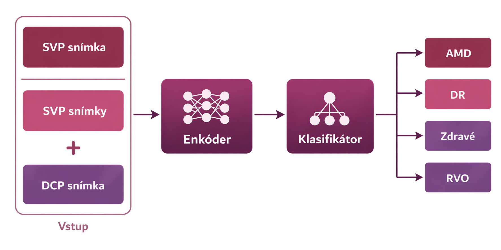
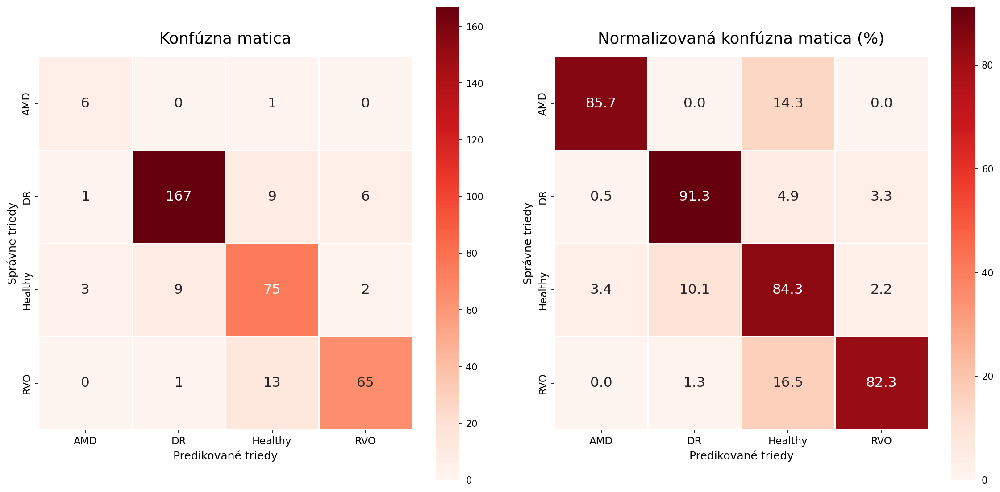

# Využitie hlbokých neurónových sietí na diagnostiku ochorení z obrazov z OCT angiografie

## Úvod

Táto práca sa zameriava na automatickú viactriednu klasifikáciu očných ochorení z OCTA snímok pomocou metód hlbokého učenia. Základom navrhnutého riešenia je samoriadene predtrénovaný Vision Transformer enkóder využívajúci princíp maskovaného autoenkódera (MAE). Klasifikačný model kombinuje informácie z dvoch cievnych vrstiev sietnice – povrchového vaskulárneho plexus (SVP) a hlbokého kapilárneho plexus (DCP) – pričom je schopný pracovať aj v prípadoch, keď DCP vrstva nie je dostupná. V rámci práce boli experimentálne porovnávané rôzne spôsoby spájania informácií z týchto vrstiev. Model rozlišuje štyri diagnostické triedy: diabetickú retinopatiu (DR), vekom podmienenú makulárnu degeneráciu (AMD), retinálnu venóznu oklúziu (RVO) a zdravé snímky. **Finálny model dosiahol vyváženú presnosť 86 % na testovacej množine.**

---

## Dataset

V rámci tejto práce bolo analyzovaných **6 456 OCTA snímok** z **7 rôznych verejne dostupných datasetov**. Datasety boli vybrané na základe dostupnosti OCTA vrstiev, diagnostických označení a plochy snímania kompatibilnej s cieľmi práce.

| Dataset | Počet snímok | Vrstvy | Diagnózy | Plocha snímania |
|---------|--------------|--------|----------|-----------------|
| **DRAC** | 611 | SVP | DR, Healthy | 12×12 mm |
| **FAZID** | 513 | SVP | DR, Myopia, Healthy | 6×6 mm |
| **M3OCTA** | 1 310 | SVP + DCP | DR, HBP, RVO, DME, VH, Healthy | 24×20 mm |
| **Mosaic** | 245 | SVP | Bez označenia | 6×6 mm |
| **OCTAGON** | 1 377 | SVP + DCP | DR, Healthy | 6×6 mm |
| **OCTA-500** | 1 800 | SVP + DCP | DR, AMD, Healthy | 6×6 mm |
| **Soul** | 600 | SVP | RVO | 6×6 mm |
| **Spolu** | **6 456** | — | — | — |

> **Poznámka:** Snímky s väčšou plochou snímania (DRAC, M3OCTA) boli predspracované a orezané na jednotnú plochu 6×6 mm centrovanú na foveálnu avaskulárnu zónu (FAZ).

---

## Štruktúra projektu

Projekt je rozdelený do troch hlavných častí:

**01 – Predspracovanie dát:** Zjednotenie a harmonizácia OCTA snímok z rôznych datasetov.

**02 – Hodnotenie kvality snímok:** Automatické filtrovanie nekvalitných alebo poškodených snímok.

**03 – Tréning modelu:** Samoriadené predtrénovanie enkódera a následná klasifikácia s multimodálnou fúziou.

---

## 01 – Predspracovanie dát

Predspracovanie dát pozostávalo zo zjednotenia OCTA snímok na jednotnú plochu snímania **6×6 mm** centrovanú na foveálnu avaskulárnu zónu (FAZ). Snímky z datasetov s väčšou plochou snímania (DRAC, M3OCTA) boli automaticky orezané, pričom softvér OCTAVA segmentoval FAZ a táto maska bola následne použitá ako centrum pre výrez. Výsledkom je harmonizovaná dátová množina vhodná na ďalšie spracovanie a tréning modelov.

---

## 02 – Hodnotenie kvality snímok

Na zabezpečenie kvality vstupných dát bol navrhnutý automatizovaný klasifikačný model na filtrovanie nekvalitných a poškodených snímok. Model **ConvNeXt Tiny** bol natrénovaný na troch kvalitatívnych triedach (*outstanding*, *gradable*, *ungradable*) s použitím dát z datasetu DRAC doplnených o manuálne označené snímky z M3OCTA a Soul. 

**Výsledky:** Model dosiahol na testovacej množine presnosť **81,82 %** s vyváženým výkonom naprieč triedami. Výstupy modelu boli následne manuálne prekontrolované, pričom niektoré snímky boli dodatočne vyradené alebo vrátené späť. Dataset OCTAGON obsahoval poškodené snímky, z ktorých sa časť podarila opraviť. Po krokoch predspracovania a hodnotenia kvality ostalo pre tréning modelu **5 801 použiteľných snímok**.

---

## 03 – Tréning modelu

Táto časť je rozdelená na dve hlavné sekcie: **tréning enkódera** (extrakcia reprezentácií) a **tréning klasifikátora** (vlastná klasifikácia ochorení).



---

### Enkóder – Samoriadené predtrénovanie

Enkóder je založený na architektúre **Vision Transformer (ViT-Small)** s mechanizmom maskovaného autoenkódera (MAE). Tréning bol rozdelený do dvoch fáz:

#### Fáza 1: Základný tréning MAE

Cieľom prvej fázy bolo naučiť enkóder všeobecné OCTA reprezentácie z neoznačených snímok. SVP a DCP snímky boli trénované ako samostatné vzorky. V rámci tejto fázy boli testované dva prístupy:

- **Baseline** – štandardný shuffle sampler
- **Balanced** – vyvážené dávky (50 % SVP + 50 % DCP s oversamplingom)

#### Fáza 2: Párový tréning s adaptáciou

Cieľom druhej fázy bolo naučiť enkóder reprezentovať vzťah medzi SVP a DCP vrstvami prostredníctvom tréningu na pároch snímok zo rovnakého oka. Boli testované tri varianty:

- **Phase 1 Baseline → Phase 2 Baseline** – základný tréning Phase 2 s pokračovaním z Phase 1 Baseline
- **Phase 1 Balanced → Phase 2 Baseline** – tréning Phase 2 na váhach z Phase 1 Balanced
- **Phase 1 Balanced → Phase 2 GRL** – s gradientnou reverznou vrstvou na potlačenie dataset-specific informácií

#### Vyhodnotenie enkódera

Kvalita naučených reprezentácií bola overená pomocou linear probe analýzy, pri ktorej enkóder zostal zmrazený a bola natrénovaná iba lineárna klasifikačná hlava. Enkódery boli testované na viacerých úlohách vrátane klasifikácie ochorení, rozpoznávania datasetu a rozlíšenia SVP a DCP vrstiev.

| Metrika | P1 Baseline | P1 Balanced | P1 Base → P2 Base | P1 Bal → P2 Base | P1 Bal → P2 GRL |
|---------|------------------|------------------|----------------------|--------------------|--------------------|  
| SVP only - Disease | 0.7000 | 0.7051 | 0.7735 | 0.7735 | 0.6691 |
| SVP only - Dataset | 0.8793 | 0.9010 | 0.8588 | 0.8588 | 0.8786 |
| DCP only - Disease | 0.5714 | 0.5974 | 0.5995 | 0.5995 | 0.5609 |
| DCP only - Dataset | 0.9511 | 0.9435 | 0.9682 | 0.9682 | 0.9264 |
| Concat - Disease | 0.6992 | 0.7632 | 0.7282 | 0.7282 | **0.8376** |
| Concat - Dataset | 0.9196 | 0.9434 | 0.9006 | 0.9006 | 0.9300 |
| Single - SVP vs DCP | 1.0000 | 1.0000 | 1.0000 | 1.0000 | 1.0000 |

Z výsledkov je viditeľné, že vyváženie v Phase 1 pomohlo dosiahnuť lepšie reprezentácie. Najlepší výkon pri klasifikácii ochorení s použitím zreťazených reprezentácií oboch vrstiev dosiahol enkóder z Fázy 2 s gradientnou reverznou vrstvou (Phase 1 Balanced → Phase 2 GRL) s vyváženou presnosťou 83,76 %. Tento enkóder bol zvolený ako základ pre finálny klasifikačný model.

---

### Klasifikátor – Multimodálna fúzia

Klasifikátor využíva predtrénovaný enkóder na extrakciu reprezentácií zo SVP a DCP vrstiev a kombinuje ich pomocou vhodnej fúznej stratégie.

#### Fúzne stratégie

V experimentoch bolo testovaných 6 typov fúzie:

1. **Využitie iba SVP embeddingu** – použitie iba SVP vrstvy bez fúzie
2. **Zreťazenie embeddingov** – konkatenácia reprezentácií oboch vrstiev
3. **Vážená fúzia embeddingov** – adaptívne váženie pomocou naučenej brány
4. **Transformer fúzia** – cross-attention mechanizmus (SVP ako query, DCP ako key/value)
5. **Priemerovanie embeddingov** – aritmetický priemer reprezentácií
6. **Prvkový súčin embeddingov** – element-wise násobenie reprezentácií

#### Experimentálne nastavenie

Klasifikátor bol testovaný v 3 rôznych rozdeleniach dát. Rozdelenie **Full** využíva všetky dostupné dáta a dosiahlo najlepšie výsledky. Rozdelenie **SVP+DCP** obsahuje pre každú triedu aspoň 50 % kombinovaných dát (SVP + DCP) doplnených o merania len s SVP vrstvou. Rozdelenie **SVP+DCP Balanced** je podobné predchádzajúcemu, ale s vyrovnaným zastúpením tried podľa triedy DR.

Pre každé rozdelenie bolo vykonaných viacero behov grid search s náhodnými kombináciami hyperparametrov (learning rate, hidden dims, dropout, encoder fine-tuning, atď.). Rozdelenie **Full** malo signifikantne lepšie výsledky pre všetky fúzie, preto sme ďalej skúmali len toto rozdelenie.

#### Výsledky – Porovnanie fúzií

**Tabuľka: Kvantitatívne výsledky fúzií na rozdelení "Full"**

| Fúzia | Balanced Accuracy (μ) | Balanced Accuracy (median) | Std Dev (σ) | IQR | % behov > 0.80 | % behov min recall > 0.70 |
|-------|----------------------|---------------------------|-------------|-----|----------------|---------------------------|
| **Transformer** | **0.83** | **0.83** | **0.023** | **0.03** | **85 %** | **80 %** |
| Concat | 0.81 | 0.81 | 0.031 | 0.04 | 62 % | 65 % |
| Mean | 0.80 | 0.81 | 0.033 | 0.04 | 58 % | 62 % |
| Gate | 0.80 | 0.81 | 0.032 | 0.04 | 55 % | 60 % |
| SVP only | 0.77 | 0.78 | 0.028 | 0.03 | 35 % | 45 % |
| Product | 0.74 | 0.75 | 0.042 | 0.06 | 18 % | 28 % |

Z výsledkov je zrejmé, že transformer fúzia dosiahla najvyšší výkon pri zároveň najnižšej variabilite naprieč konfiguráciami. Kombinácia SVP a DCP vrstiev priniesla lepšie výsledky než použitie samotnej SVP vrstvy, čo potvrdzuje pridanú hodnotu hlbokej cievnej vrstvy pre klasifikáciu. Jednoduchšie fúzne prístupy (zreťazenie, priemerovanie, vážená fúzia) dosahovali pri vhodnom nastavení hyperparametrov porovnateľný výkon, avšak vykazovali vyššiu variabilitu. Prvkový súčin embeddingov vykazoval najnižšiu stabilitu a najväčšiu citlivosť na konfiguráciu modelu.

---

### Finálny model

Na základe experimentov bol vybraný finálny model využívajúci transformer fúziu. Model dosiahol vyváženú presnosť 86 % a presnosť 86 % na testovacej množine, pričom minimálny recall naprieč triedami bol 82 %.

#### Výsledky podľa tried

| Trieda | Precision | Recall | F1-score |
|--------|-----------|--------|----------|
| AMD | 0.60 | 0.86 | 0.71 |
| DR | 0.94 | 0.91 | 0.93 |
| Healthy | 0.77 | 0.84 | 0.80 |
| RVO | 0.89 | 0.82 | 0.86 |
| **Macro average** | **0.86** | **0.86** | **0.82** |

#### Konfúzna matica



Z konfúznej matice je viditeľné, že trieda AMD bola klasifikovaná s najvyššou presnosťou s recall 99 %. Triedy RVO a Healthy dosahovali stabilný recall okolo 82–88 %. Trieda DR bola náročnejšia s recall 85 %, pričom najčastejšie dochádzalo k zámenám so zdravými snímkami, čo môže súvisieť s vizuálnou podobnosťou skorých štádií ochorenia.

---

## Ako použiť tento projekt

Všetky potrebné materiály na reprodukciu experimentov a výsledkov sú k dispozícii.

### Kód a implementácia

Celá implementácia projektu je dostupná v tomto GitHub repozitári.
### Dáta a natrénované modely

Všetky vstupné dáta, predspracované datasety, CSV/Excel súbory a natrénované modely sú dostupné na OneDrive úložisku:

**OneDrive:** [Data na stiahnutie](https://drive.google.com/drive/folders/1iCWLYVkI6l7NFqILIIMPI2Aeo9oMjtxD?usp=sharing)

**Obsah:**
- `datasets/` – pôvodné OCTA snímky zo 7 datasetov
- `data/` – predspracované dáta použité v experimentoch
- `master_table.xlsx` – rozdelenie dát na train/val/test
- `labeled_dataset.csv` – označené snímky pre tréning quality filtering modelu
- `convnext_tiny_28/` – predtrénovaný model na hodnotenie kvality
- `phase1/`, `phase2/` – natrénované enkódery (všetky experimenty)
- `results/` – výstupy z grid search a finálneho modelu

### Používateľská príručka

Podrobný návod na reprodukciu experimentov, nastavenie prostredia a spustenie všetkých častí projektu je dostupný v dokumente Používateľská príručka (Dodatok A z diplomovej práce).

**Používateľská príručka:** [(PDF)](https://drive.google.com/file/d/1T6L6GebM4ENaGlSspkTKmwq-vL54b5jc/view?usp=drive_link)

**Príručka obsahuje:**
- Inštrukcie na inštaláciu závislostí (`requirements.txt`)
- Krok-za-krokom návod pre každú časť projektu
- Popis, kam umiestniť stiahnuté dáta z OneDrive
- Ako použiť predtrénované modely vs. trénovať vlastné
- Riešenie bežných problémov

---

## Citácia

Ak využijete túto prácu vo svojom výskume, prosím citujte:

```bibtex
@mastersthesis{murinova2026octa,
  author  = {Murínová, Klára},
  title   = {Využitie hlbokých neurónových sietí na diagnostiku ochorení z obrazov z OCT angiografie},
  school  = {Slovenská technická univerzita v Bratislave, Fakulta elektrotechniky a informatiky},
  year    = {2026},
  type    = {Diplomová práca},
  address = {Bratislava, Slovensko}
}
```

---

## Kontakt

**Autor:** Bc. Klára Murínová  
**Email:** klara_murinova965@gmail.com  
**Vedúca práce:** MUDr. Veronika Kurilová, PhD.  
**Škola:** Slovenská technická univerzita v Bratislave, FEI  
**Rok:** 2026
